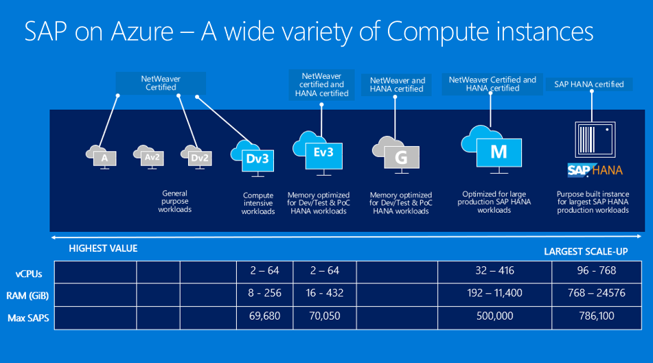
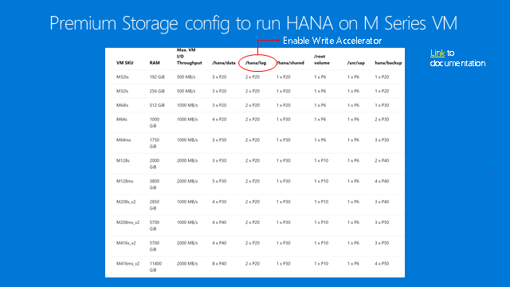
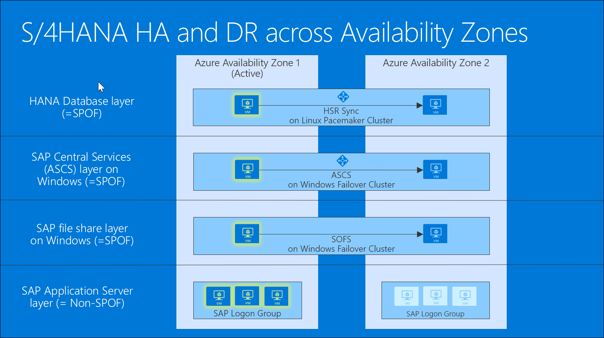



SAP HANA on Azure

 Whiteboard design session student guide

October 2020

Information in this document, including URL and other Internet Web site references, is subject to change without notice. Unless otherwise noted, the example companies, organizations, products, domain names, e-mail addresses, logos, people, places, and events depicted herein are fictitious, and no association with any real company, organization, product, domain name, e-mail address, logo, person, place or event is intended or should be inferred. Complying with all applicable copyright laws is the responsibility of the user. Without limiting the rights under copyright, no part of this document may be reproduced, stored in or introduced into a retrieval system, or transmitted in any form or by any means (electronic, mechanical, photocopying, recording, or otherwise), or for any purpose, without the express written permission of Microsoft Corporation.

Microsoft may have patents, patent applications, trademarks, copyrights, or other intellectual property rights covering subject matter in this document. Except as expressly provided in any written license agreement from Microsoft, the furnishing of this document does not give you any license to these patents, trademarks, copyrights, or other intellectual property.

The names of manufacturers, products, or URLs are provided for informational purposes only and Microsoft makes no representations and warranties, either expressed, implied, or statutory, regarding these manufacturers or the use of the products with any Microsoft technologies. The inclusion of a manufacturer or product does not imply endorsement of Microsoft of the manufacturer or product. Links may be provided to third party sites. Such sites are not under the control of Microsoft and Microsoft is not responsible for the contents of any linked site or any link contained in a linked site, or any changes or updates to such sites. Microsoft is not responsible for webcasting or any other form of transmission received from any linked site. Microsoft is providing these links to you only as a convenience, and the inclusion of any link does not imply endorsement of Microsoft of the site or the products contained therein.

© 2020 Microsoft Corporation. All rights reserved.

Microsoft and the trademarks listed at https://www.microsoft.com/en-us/legal/intellectualproperty/Trademarks/Usage/General.aspx are trademarks of the Microsoft group of companies. All other trademarks are property of their respective owners.

**Contents**

<!-- TOC -->

- [SAP HANA on Azure whiteboard design session student guide](#sap-hana-on-azure-whiteboard-design-session-student-guide)
  - [Abstract and learning objectives](#abstract-and-learning-objectives)
  - [Prerequisites](#prerequisites)
  - [Step 1: Review the customer case study](#step-1-review-the-customer-case-study)
    - [Customer situation](#customer-situation)
    - [Contoso S/4HANA Deployment Priorities](#contoso-s4hana-deployment-priorities)
    - [Customer needs and objections](#customer-needs-and-objections)
    - [Key design considerations](#key-design-considerations)
    - [Infographic for key design concepts](#infographic-for-key-design-concepts)
  - [Step 2: Design a proof of concept solution](#step-2-design-a-proof-of-concept-solution)
  - [Step 3: Present the solution](#step-3-present-the-solution)
  - [Wrap-up](#wrap-up)
  - [Additional references](#additional-references)

<!-- /TOC -->

# SAP HANA on Azure whiteboard design session student guide

## Abstract and learning objectives 

In this workshop, you will look at what is involved in deploying SAP HANA on Azure with the goals of designing for in-memory database performance, business continuity and flexibility as well as fully optimized total cost of ownership. 

At the end of this whiteboard design session you will be able to design SAP HANA workloads on Azure in alignment with SAP HANA certification with high availability and disaster recovery, run Azure Pricing Calculator to price the SAP HANA landscape, and present the solution to business/technical decision makers and handle Q&A with customer. 

## Prerequisites

-   R-AIT344 : Architecture deep dive for SAP deployments

-   R-AIT333 : SAP Migration Practitioner Panel

-   Understanding of SAP on Azure Webinar Training and S/4HANA on Azure reference architecture 

## Step 1: Review the customer case study 

**Outcome**

Analyze your customer's needs.

Timeframe: 15 minutes

Directions: With all participants in the session, the facilitator/SME presents an overview of the customer case study along with technical tips.

1.  Meet your table participants and trainer.

1.  Read all of the directions for steps 1-3 in the student guide.

1.  As a table team, review the following customer case study.

### Customer situation

Contoso Group is a pharmaceutical company with its headquarters based in Boston, US.  

Contoso Leadership and Planning Groups want to drastically reduce server and storage hardware in their own datacenters to minimize IT related costs. Leadership has asked Contoso IT to explore the possibility to deploy a greenfield S/4HANA environment to cloud. In addition to NetWeaver-based apps, Contoso wants to evaluate the option of implementing XSA-based apps. 

Since Contoso already has a number of their non-SAP systems running to Azure, Contoso IT decided to leverage its knowledge of the Microsoft cloud platform and existing ExpressRoute connectivity and host its SAP S/4HANA landscape in Azure. 

Considering that Contoso finance and supply chain teams will strongly rely on S/4HANA, the systems should be highly available, and their performance must be predictable and consistent. In addition, the management team wants to leverage disaster recovery capabilities offered by Azure in order to ensure resiliency in case the primary region hosting the new deployment becomes unavailable. 

Andrew Cross, CIO of Contoso Group emphasized this point by stating, "Our planned operational dependencies on SAP applications force us to seek reasonably priced high availability and disaster recovery capabilities for our production SAP S/4HANA deployments.” 

Before implementing the production environment, Contoso wants to test its new deployment approach by provisioning development, and UAT environments in Azure.

### Contoso S/4HANA Deployment Priorities

-   In-memory database performance and agility to scale

-   High Availability & Disaster Recovery

-   Data protection & security

-   Streamlined and automated deployment methodology

-   IT standardization across SAP and non-SAP

1.  Contoso S/4HANA requirements:

1.  Target environment:

    -   Sizing

        -   Production

            -   HANA DB memory requirement; 2 TiB

            -   Application SAPS requirements (SAPS): 15,000

        -   Quality Assurance

            -   HANA DB memory requirement; 2 TiB

            -   Application SAPS requirements (SAPS): 15,000

        -   Development

            -   HANA DB memory requirement; 192 GiB

            -   Application SAPS requirements (SAPS): none

1.  Business continuity

    -   High Availability and Disaster Recovery

        -   Each proposed solution must include both high availability and disaster recovery capabilities for the Production environment (99.95% uptime).

        -   Each proposed solution must include high availability for the Quality Assurance environment (99.95% uptime).

        -   The disaster recovery solution must ensure business continuity in case of an event affecting the entire Azure datacenter hosting the Production environment.

    -   Data protection

        -   No data loss allowed in the Production and the Quality Assurance environment

        -   Production

            -   HANA DB log backup taken every 30 minutes and retained for 1 day

            -   HANA DB full backup every night and retained for 1 month

        -   Quality Assurance

            -   HANA DB full bi-weekly backup retained for 1 month

        -   Development

            -   HANA DB full bi-weekly backup retained for 1 month

### Customer needs and objections 

1.  Is the proposed solution fully certified by SAP? 

1.  Does the proposal meet Contoso business continuity requirements? What if there's outage on VM or storage? How can we restore from backup? How can we failover the landscape in case of an outage?

1.  There're legacy on-prem systems that need to interact with S/4HANA in cloud. How can we minimize performance impact in cross-premises scenarios? 

1.  Can we change the size of the environment if sizing requirements change in future?

1.  Is there anything not included in the results of Azure Pricing Calculator? 

1.  CFO is asking for cost saving even further. What can we do to optimize the cost? What are our options?

### Key design considerations

1.  Key design components

    -   HANA System Replication

    -   Windows/Linux clusters

    -   Windows SOFS or Linux DRBD or Azure NetApp Files

    -   Azure Site Recovery

    -   VNet Hub & Spoke topology

1.  Two primary HA/DR options

    -   HA in an Availability Set and DR across regions (DR replica can coexist with QA in the second region)

    -   HA/DR across Availability Zones

1.  Networking considerations

    -   ExpressRoute for end user access with geo-redundancy provisions

    -   Site-to-Site VPN for remote administration and monitoring

1.  Additional infrastructure considerations

    -   Blob storage for backup retention

    -   Jump-box

    -   DNS

    -   Patching

    -   Backup

    -   Monitoring

    -   Cluster arbitration (Cloud Witness and SBD)

    -   Proximity placement groups

1.  Pricing

    -   Use Azure Pricing Calculator

    -   Use Reserved VM Instances option if it helps save costs

    -   Consider best OS licensing option(s):

        -   It is common NOT to include Windows license costs because of Azure Hybrid Use Benefits

        -   Linux OS subscription costs can be based on Azure Marketplace

    -   Provide assumptions for ExpressRoute bandwidth

    -   Make sure to include the required minimum level of Azure support (e.g. Azure Professional Direct, whenever applicable).

### Infographic for key design concepts

## Step 2: Design a proof of concept solution

**Outcome**

Design a solution and prepare to present the solution to the target customer audience in a 15-minute chalk-talk format.

Timeframe: 60 minutes

**Business needs**

Directions:  With all participants at your table, answer the following questions and list the answers on a flip chart:

1.  Who should you present this solution to? Who is your target customer audience? Who are the decision makers?

1.  What customer business needs do you need to address with your solution?

**Design**

Directions: With all participants at your table, respond to the following questions on a flip chart:

*High-level solution architecture:*

1.  How would you ensure that the high-availability and disaster recovery requirements are satisfied?

1.  What should be the Azure region(s) where the solution will be deployed?

*Network design:*

1.  What should be the hybrid connectivity option?

1.  What should be the Azure virtual network design in order to maximize security?

*SAP deployment architecture and methodology:*

1.  What will be the configuration of the application and database components of your solution?

1.  What should be the SAP deployment methodology?

*Solution cost:*

1.  What is the estimated cost of your solution? Provide pricing for *HA/DR* and *cost conscious* (without HA/DR) options.

**Prepare**

Directions: With all participants at your table:

1.  Identify any customer needs that are not addressed with the proposed solution.

1.  Identify the benefits of your solution.

1.  Determine how you will respond to the customer's objections.

Prepare a 15-minute chalk-talk style presentation to the customer.

## Step 3: Present the solution

**Outcome**

Present a solution to the target customer audience in a 15-minute chalk-talk format.

Timeframe: 30 minutes

**Presentation**

Directions:

1.  Pair with another table.

1.  One table is the Microsoft team and the other table is the customer.

1.  The Microsoft team presents their proposed solution to the customer.

1.  The customer makes one of the objections from the list of objections.

1.  The Microsoft team responds to the objection.

1.  The customer team gives feedback to the Microsoft team.

1.  Tables switch roles and repeat Steps 2-6.

##  Wrap-up 

Timeframe: 20 minutes

Directions: Tables reconvene with the larger group to hear the facilitator/SME share the preferred solution for the case study.

##  Additional references

|    |            |
|----------|:-------------:|
| **Description** | **Links** |
| High availability of SAP HANA on Azure VMs on SUSE Linux Enterprise Server | <https://docs.microsoft.com/en-us/azure/virtual-machines/workloads/sap/sap-hana-high-availability/> |
| High availability for SAP NetWeaver on Azure VMs on SUSE Linux Enterprise Server with Azure NetApp Files for SAP applications | <https://docs.microsoft.com/en-us/azure/virtual-machines/workloads/sap/high-availability-guide-suse> |
| SAP HANA high availability for Azure virtual machines | <https://docs.microsoft.com/en-us/azure/virtual-machines/workloads/sap/sap-hana-availability-overview> |
| SAP HANA availability within one Azure region | <https://docs.microsoft.com/en-us/azure/virtual-machines/workloads/sap/sap-hana-availability-one-region> |
| SAP HANA availability across Azure regions | <https://docs.microsoft.com/en-us/azure/virtual-machines/workloads/sap/sap-hana-availability-across-regions> |
| SAP workload configurations with Azure Availability Zones | <https://docs.microsoft.com/en-us/azure/virtual-machines/workloads/sap/sap-ha-availability-zones>
| Automated SAP Deployments in Azure Cloud | <https://github.com/Azure/sap-hana> |
